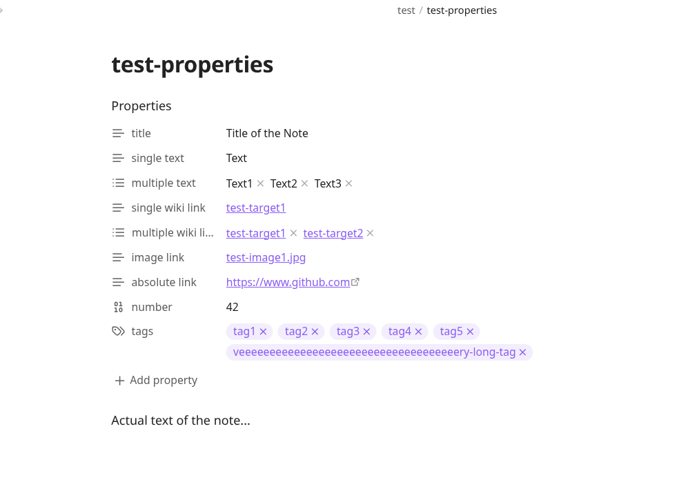
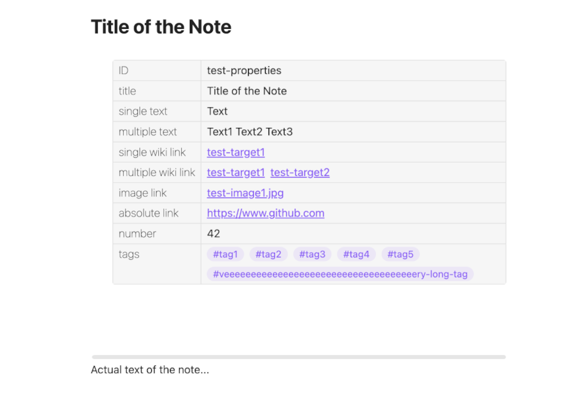

# Obsidian post-export script

This script add frontmatter properties to the exported web page, after exporting an [Obsidian](https://obsidian.md/) vault using the (great!) community plugin [obsidian-webpage-export](https://github.com/KosmosisDire/obsidian-webpage-export).

It is intended as a mitigation for issues [#406](https://github.com/KosmosisDire/obsidian-webpage-export/issues/406) and [#621](https://github.com/KosmosisDire/obsidian-webpage-export/issues/621).

It can break any time when the author of that plugin changes how the html files are generated - e.g. when eventually implementing his functionality as part of the plugin itself.

## Approach
- **Does not modify the plugin**: This script works independently and does not require any changes to the obsidian-webpage-export plugin.
- **Post-export script**: Designed to be run as a post-export script, making use of frontmatter raw data already present but not rendered in exported HTML files.
- **Evening hack**: Created quickly to address the need for visible frontmatter properties in exported files.

## Features
- Recursively iterates over all exported HTML files
- Adds a properties table below the title in each file
- Sets the page title (both h1 and browser title) to the value of the `title`|`Title`|`Titel` property, if it exists


## Installation
Install dependencies using npm:

```sh
npm install
```

## Usage
Run this script after exporting your notes with obsidian-webpage-export.
You can run the script using either Bun or Node.js:

**With Bun**
```sh
bun src/addFrontmatter.ts <exported-folder>
```

**With Node.js**
```sh
node src/addFrontmatter.js <exported-folder>
```

Replace `<exported-folder>` with the path to your exported HTML files.

## Screenshots
Below are screenshots showing the properties table both in Obsidian and the exported web page.

<table>
  <tr>
    <td width=50%>Obsidian</td>
    <td>Exported Web Page</td>
  </tr>
</table>

